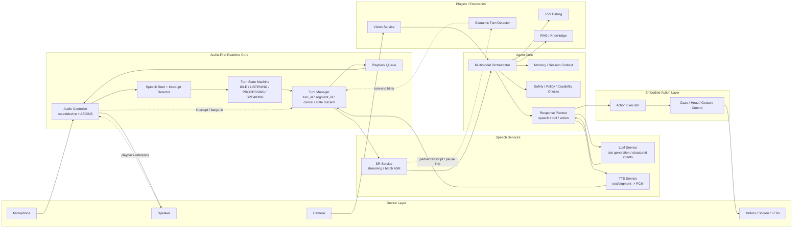

# Audio-First Agentic System Design

Bu dokuman, projeyi gelecekte `Audio Controller + SR + LLM + TTS` cekirdegi etrafinda
buyutmek icin onerilen genel mimariyi aciklar. Amac, mevcut `AEC-first` ses omurgasini
korurken sistemi multimodal ve agentic genislemelere elverisli hale getirmektir.

## Temel Yaklasim

Bu sistem icin en dogru tanim:

- `audio-first`
- `controller-centric`
- `multimodal`
- `agent-orchestrated`

Buradaki en kritik mimari ilke sudur:

- gercek zamanli ses davranisi `Audio Controller` etrafinda kurulmalidir

Yani:

- `AEC`, playback ve interrupt karari ayni merkezde kalir
- `SR`, `LLM` ve `TTS` degistirilebilir servisler olarak konumlanir
- vision, tool calling, RAG ve embodied action gibi genislemeler ust katmanlarda ele alinir

## Neden Audio-First?

Bu projede en zor ve en gecikmeye duyarli kisim dil modeli degil, gercek zamanli ses
etkilesimidir.

Ozellikle:

- hoparlore giden sesin `AEC` referansi olarak kullanilmasi
- robot konusurken kullanicinin araya girebilmesi
- stale veya gecikmis sonucularin discard edilmesi
- playback ve interrupt kararinin birbirinden kopmamasi

gibi gereksinimler sebebiyle sistemin omurgasi ses tarafinda kalmalidir.

## Katmanlar

### 1. Audio Controller

Sistemin en kritik cekirdegidir.

Sorumluluklari:

- mikrofon ve hoparlor stream yonetimi
- `AEC/NS`
- acoustic VAD ve speech-start detection
- interrupt ve barge-in mantigi
- playback queue
- `turn_id`, `segment_id`, cancel ve stale-result discard

Bu katman mumkun oldugunca dar, deterministic ve gercek zamanli kalmalidir.

### 2. SR Service

Konusmayi yaziya ceviren servis katmanidir.

Sorumluluklari:

- streaming veya batch transcription
- partial ve final transcript
- confidence ve timing bilgileri

Bu servis ileride farkli SR backend'leri ile degistirilebilir olmalidir.

### 3. LLM Service

Dil tabanli yorumlama ve yanit uretimi icin kullanilir.

Sorumluluklari:

- metin anlama
- metin uretimi
- streaming text output
- yapilandirilmis intent veya tool/action taslagi uretimi

Ancak bu servis, tek basina tum embodied davranis mantigini tasimamalidir.

### 4. TTS Service

Metni sese ceviren servis katmanidir.

Sorumluluklari:

- tam metin veya segment bazli sentez
- `PCM int16` ses uretimi
- gerekirse viseme veya timing metadata saglama

Onemli sinir:

- `TTS` sesi calmamali, sadece uretmelidir
- playback her zaman `Audio Controller` tarafinda kalmalidir

### 5. Agent Core

Sistemin multimodal karar katmanidir.

Sorumluluklari:

- `SR`, vision, memory ve tool sonucularini birlestirmek
- hangi yetenegin ne zaman kullanilacagina karar vermek
- text, speech ve action plan uretmek
- policy ve capability kontrolu yapmak

Bu katman sistemin asil "beyni" olarak dusunulmelidir.

### 6. Plugin / Extension Layer

Bu katman cekirdek mimariyi bozmadan yeni yeteneklerin eklenmesini saglar.

Ornekler:

- vision
- RAG
- tool calling
- semantic turn detection
- speaker identification
- diger model veya provider entegrasyonlari

### 7. Embodied Action Layer

Robotun fiziksel davranislarini uygulayan katmandir.

Sorumluluklari:

- gesture
- gaze ve head control
- ekran veya isik kontrolu
- hareket ve diger robot eylemleri

Bu katman `LLM`'in kendisi olmamali; `Agent Core` tarafindan uretilen planlari
guvenli ve uygulanabilir sekilde icra etmelidir.

## Temel Veri Akisi

1. `Audio Controller` mikrofon verisini alir ve temizler
2. konusma baslangici ve bitisi controller tarafinda belirlenir
3. ses `SR Service`'e gonderilir
4. transcript `Agent Core`'a ulasir
5. `Agent Core` gerekirse `LLM`, vision, tool veya RAG kullanir
6. uretilen yanut plani iki kola ayrilir:
   - konusulacak kisim `TTS Service`'e gider
   - fiziksel davranislar `Embodied Action Layer`'a gider
7. `TTS` ses uretir
8. `Audio Controller` bu sesi playback queue uzerinden calar
9. kullanici araya girerse interrupt yine `Audio Controller` tarafinda yonetilir

## Gelecekteki Genislemeler Icin Uygunluk

Bu mimari su senaryolara elverislidir:

- streaming SR
- semantic VAD veya turn-end modeli
- farkli `SR`, `LLM` ve `TTS` backend'leri
- multimodal context fusion
- tool calling
- RAG
- embodied robot davranislari
- gelecekte hibrit veya alternatif `speech-to-speech` response engine'leri

Ancak bunun saglikli calismasi icin servis kontratlari basta su ozelliklerle
tasarlanmalidir:

- streaming destegi
- cancel destegi
- `turn_id` ve `segment_id`
- stale-result discard uyumlulugu
- capability tabanli servis sinirlari

## Onerilen Mermaid Diyagrami

## Kisa Sonuc

Bu proje icin en saglikli yon:

- altta `Audio Controller` merkezli gercek zamanli omurga
- ortada degistirilebilir `SR`, `LLM`, `TTS` servisleri
- ustte multimodal `Agent Core`
- yanlarda plugin ve embodied action genislemeleri

Boylece sistem hem bugunku ses ihtiyaclarini korur hem de ileride daha buyuk bir
humanoid robot yazilim yiginina dogru genisleyebilir.
