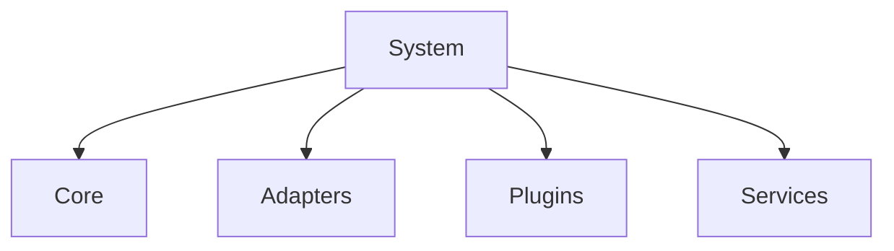

# Future Core System

Bu dokuman, projenin gelecekte nasil daha moduler, genisletilebilir ve embodied
agent uygulamalarina uygun hale getirilebilecegini anlatir.

Temel fikir sudur:

- sistem `core-first`
- ama ayni zamanda `plugin-friendly`

Yani sistemin davranis kurallari ve orchestration mantigi kucuk, saglam ve merkezi
bir `Core` icinde tutulur; degisebilir veya sonradan eklenebilir yetenekler ise bu
cekirdegin etrafinda konumlanir.

## Ust Seviye Hiyerarsi

En temiz ust seviye ayrim su sekildedir:

- `System`
  - `Core`
  - `Adapters`
  - `Plugins`
  - `Services`

Kisa form:

- `System = Core + Adapters + Plugins + Services`

## Neden Core-First?

Bu projede zamanla degisecek cok sey vardir:

- farkli `SR`, `LLM`, `TTS` backend'leri
- vision
- tool calling
- semantic turn detection
- RAG
- embodied action katmanlari
- yeni sensor veya event kaynaklari

Ama degismemesi gereken seyler de vardir:

- event tabanli calisma mantigi
- state ve interaction yonetimi
- priority ve arbitration
- cancel ve preemption
- lifecycle ve ID yonetimi

Iste bunlar `Core` icinde tutulmalidir.

## Bilesenler

### 1. `Core`

`Core`, sistemin degismesi en zor ve en merkezi parcasidir.

Sorumluluklari:

- event akisini yonetmek
- interaction durumlarini tasimak
- oncelik ve arbitration yapmak
- task ve action akisini orkestre etmek
- cancellation ve lifecycle mantigini korumak

`Core`, belirli bir modele veya entegrasyona bagimli olmamalidir.

### 2. `Adapters`

`Adapters`, `Core` ile dis dunya arasindaki baglanti katmanidir.

Amaçlari:

- `Core` icindeki komutlari dis servis cagrilarina cevirir
- dis servis veya cihazlardan gelen sonuculari sistem event'ine donusturur
- entegrasyon detaylarini `Core`'dan ayirir

Ornek adapter alanlari:

- `SR`
- `LLM`
- `TTS`
- vision
- motion
- tools

### 3. `Plugins`

`Plugins`, sistemin sonradan genisletilebilen opsiyonel yetenek alanidir.

Bunlar:

- cekirdegi degistirmeden eklenebilir
- cikarilabilir veya degistirilebilir
- belirli bir ihtiyac dogdugunda devreye alinabilir

Ornekler:

- semantic turn detection
- RAG uzantilari
- policy/safety uzantilari
- custom skills
- yeni algi veya karar modulleri

### 4. `Services`

`Services`, agir model, inference veya bagimsiz yetenek bilesenleridir.

Ornekler:

- `SR service`
- `LLM service`
- `TTS service`
- vision backend
- retrieval backend
- tool backend

Bu bilesenlerin sistemin ana state mantigini tasimasi beklenmez. Onlar yetenek
sunar; orchestration ise `Core` tarafinda kalir.

## Tasarim Ilkeleri

Bu gelecekteki sistem icin temel ilkeler su sekilde olmalidir:

- `Core` kucuk ama guclu olmali
- entegrasyon detaylari `Adapters` icinde kalmali
- opsiyonel genislemeler `Plugins` olarak eklenmeli
- agir model veya dis yetenekler `Services` olarak calismali
- sistem genelinde event, state, cancel ve lifecycle mantigi merkezi olmali

## Neden Bu Ayrim Faydalidir?

Bu yapi sayesinde:

- yeni model eklemek kolaylasir
- farkli provider denemeleri sistemin merkezini bozmaz
- yeni robot yetenekleri sonradan eklenebilir
- sistem giderek buyuse bile mimari duzensizlesmez
- embodied ve multimodal gelecege daha saglam bir temel olusur

## Basit Diyagram

## Kisa Sonuc

Bu proje icin en saglikli gelecek yonu:

- `core-first`
- `adapter-based`
- `plugin-friendly`
- `service-extended`

Yani sistemin asil davranis mantigi kucuk ve merkezi bir `Core` icinde kalir; geri
kalan her sey bu merkezin etrafinda genisleyebilir.
