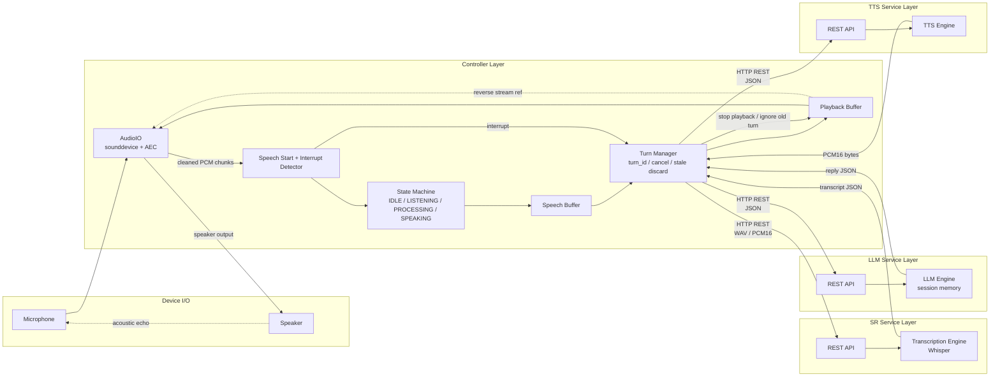

# Local Service Split Architecture

Bu doküman, mevcut `AEC-first` ses hattını bozmadan projeyi yerelde çalışan bir
`controller + SR + LLM + TTS` yapısına ayırmak için önerilen mimariyi açıklar.

## Amaç

Hedef:

- mevcut konuşma akışını korumak
- robot konuşurken interrupt davranışını bozmamak
- `SR`, `LLM` ve `TTS` kısımlarını bağımsız servisler olarak ayırmak
- buna rağmen gerçek zamanlı ses tarafını tek merkezde tutmak

Bu projede en kritik teknik kural şudur:

- `AEC`, playback ve interrupt kararı aynı controller içinde kalmalıdır

Sebep:

- hoparlöre gerçekten gönderilen örnekler `AEC` için referans olarak kullanılır
- playback controller dışına taşınırsa referans zinciri zayıflar
- bu da robotun kendi TTS sesini kullanıcı konuşması sanma riskini artırır

## Temel Tasarım Kararı

Servislere bölünmesi önerilen parçalar:

- `SR`: speech-to-text
- `LLM`: yanıt üretimi
- `TTS`: metinden ses üretimi

Controller içinde kalması gereken parçalar:

- `audio_io.py` içindeki `sounddevice` stream ve `AEC/NS`
- `main.py` içindeki state machine
- playback buffer yönetimi
- interrupt detection
- `turn_id`, cancel ve stale-result discard mantığı

Özellikle `TTS` servisi sesi çalmamalıdır.

Doğru sınır:

- `TTS service` sadece `16 kHz mono PCM int16` üretir
- controller bu sesi `AudioIO.start_playback()` ile çalar

## Katmanlar ve Haberleşme

| Katman | Sorumluluk | Servis tipi | Önerilen haberleşme | Veri tipi | Not |
|---|---|---|---|---|---|
| `Controller / Audio Frontend` | `sounddevice`, `AEC`, state machine, interrupt, playback | Ana process | In-process | `numpy.int16`, queue | En düşük latency burada gerekir |
| `SR Service` | Segment bazlı transcription | Local microservice | `HTTP REST` | WAV veya `pcm_s16le` | Request-response için yeterli |
| `LLM Service` | Metin üretimi, konuşma geçmişi | Local microservice | `HTTP REST` | JSON | Text tabanlı olduğu için REST en sade çözüm |
| `TTS Service` | Metinden ses üretimi | Local microservice | `HTTP REST` | İstek JSON, yanıt `application/octet-stream` PCM | JSON/base64 yerine binary yanıt tercih edilmeli |
| `Turn / Cancel Control` | `turn_id`, `session_id`, timeout, discard | Controller içi orkestrasyon | In-process + hafif RPC | Küçük metadata mesajları | Yarış durumlarını azaltır |

## Neden REST?

Bu proje için ilk aşamada en dengeli seçim `localhost` üstünde `HTTP REST` olur.

Avantajları:

- basit uygulanır
- servisler bağımsız test edilebilir
- loglama ve hata ayıklama kolaydır
- `SR`, `LLM`, `TTS` tarafında request-response modeline iyi uyar

Sınırları:

- gerçek zamanlı audio callback taşımak için uygun değildir
- `Unix Domain Socket` kadar düşük overhead sunmaz
- büyük binary payload için dikkatli tasarlanmalıdır

Bu nedenle öneri şudur:

- `SR`, `LLM`, `TTS` servis çağrıları REST ile yapılsın
- gerçek zamanlı audio callback ve playback controller içinde kalsın

## Önerilen Akış

1. Controller mikrofondan temizlenmiş chunk'ları alır.
2. `IDLE -> LISTENING` geçişi controller içinde verilir.
3. Konuşma bitince controller segmenti `SR` servisine yollar.
4. Transcript controller'a dönünce `LLM` servisine iletilir.
5. LLM yanıtı controller'a dönünce `TTS` servisine gönderilir.
6. `TTS` servisi `PCM int16` ses döndürür.
7. Controller dönen örnekleri playback buffer'a yazar.
8. Aynı playback verisi hoparlöre giderken `AEC` için reverse reference olarak kullanılır.
9. Kullanıcı robot konuşurken tekrar konuşursa interrupt kararı controller'da verilir.
10. Interrupt olursa playback durur ve eski turn sonuçları çöpe atılır.

## Mermaid Diyagram



## Endpoint Taslağı

### `SR`

`POST /sr/recognize`

- request: WAV veya raw `pcm_s16le`
- response: transcript JSON

Örnek response:

```json
{
  "turn_id": 17,
  "text": "merhaba nasilsin",
  "duration_ms": 1840
}
```

### `LLM`

`POST /llm/generate`

- request: `turn_id`, `session_id`, `text`
- response: yanıt metni

Örnek response:

```json
{
  "turn_id": 17,
  "text": "Iyiyim, tesekkur ederim."
}
```

### `TTS`

`POST /tts/synthesize`

- request: `turn_id`, `text`, `voice`, `sample_rate`
- response: `application/octet-stream` olarak `pcm_s16le`

Not:

- `TTS` için JSON + base64 yerine binary response tercih edilmelidir

## Korunması Gereken Davranışlar

Servisleşme sonrası da aşağıdakiler değişmemelidir:

- `IDLE -> LISTENING -> PROCESSING -> SPEAKING` akışı
- interrupt kararının temizlenmiş mikrofonda verilmesi
- playback başlarken input queue temizlenmesi
- playback biterken residual etkileri azaltan kısa ignore penceresi
- robot konuşurken gelen yeni insan konuşmasının aktif turn'ü kesebilmesi

## Operasyonel Kurallar

Her servis çağrısında:

- `turn_id` kullanılmalı
- eski `turn_id` ile gelen cevaplar discard edilmeli
- `LLM` için `session_id` kullanılmalı
- timeout uygulanmalı
- mümkünse cancel endpoint veya cancel-aware davranış eklenmeli

## Ne Zaman Daha Düşük Seviyeli IPC Gerekir?

İlk aşamada REST yeterlidir. Ancak ileride:

- daha düşük gecikme
- daha büyük binary audio payload
- streaming tabanlı SR/TTS

gerekirse şu seçenekler değerlendirilebilir:

- `Unix Domain Socket`
- `Unix Domain Socket + shared memory`

Bu geçiş, controller sınırı korunursa daha sonra yapılabilir.
